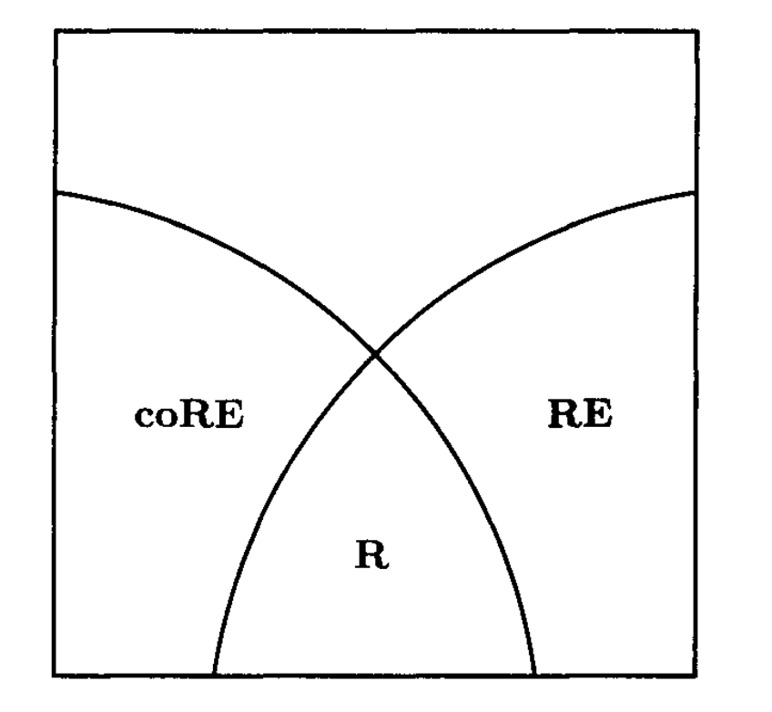

Ch. 1

- An *algorithm* is a detailed step-by-step method for solving a problem. 
- the precise representation of a problem does not matter much. 
- p.8: Decision problem v.s. Optimization problem. 
- A *reduction* is an algorithm that solves problem $A$ by transforming any instance of $A$ to an equivalent instance of a previously solved problem $B$.
A central tool of complexity theory is a perverse use of reduction, 
in which a problem is reduced not to an already-solved one, 
but to a problem that we wish to show is *difficult*. 

- History mark:
    - Jack Edmonds used the term "good algorithm" for polynomial time.
    - the $\mathcal{O}$-notation was proposed in `[D. E. Knuth, "Big omicron and big omega and big theta," ACM SIGACT News, 8(2), pp. 18-24, 1976]`.

Ch. 3

- all recursively enumerable languages can be reduced to H.
- HALTING is then a complete problem for the class of recursively enumerable problems.
- If $L$ is recursive, then so is $\bar{L}$.

- $\bar{H}$ is not recursively enumerable but $H$ was ==> *the* class of *recursively enumerable languages is not closed under complement.*

- $L$ is recursive iff both $L$ and $\bar{L}$ are recursively enumerable.

- 
    1. RE: the recursively enumerable ones.
    2. coRE: the complements of recursively enumerable languages.
    3. R: the recursive languages.